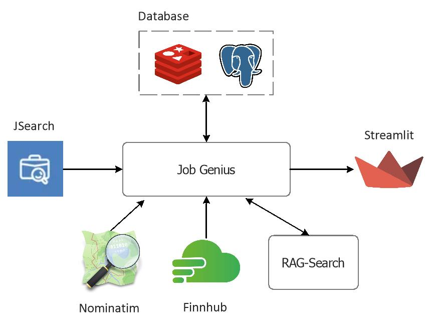
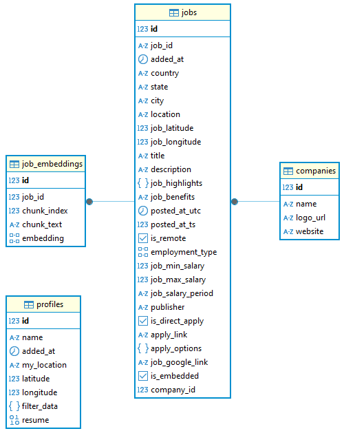

# Job-Genius

Job-Genius is an AI-powered job discovery and automation platform designed to simplify and personalize the job search process. Whether you're actively seeking employment or exploring market trends, Job-Genius helps you find, analyze, and match jobs efficiently with minimal manual effort.

## Motivation

Job hunting is a time-consuming and often frustrating process. Manually checking multiple job boards is not only repetitive but also inefficient. Job seekers routinely face the burden of re-entering the same filters across platforms, struggling to compare listings in different formats, and wasting hours reading irrelevant or low-quality descriptions. This fragmented workflow often leads to missed opportunities and decision fatigue, especially when listings are hidden, poorly formatted, or scattered across sites.

Job-Genius is built to solve these pain points with a fully automated and intelligent job search pipeline. With just a one-time setup (including filter preferences and resume upload) the system continuously monitors the job market, collects high-quality listings from trusted sources, and applies dynamic, real-time filters tailored to each user. AI models analyze the semantic fit between your resume and job descriptions, generating compatibility scores to remove guesswork from the application process. Personalized job alerts notify users only when meaningful matches are found, ensuring relevance and eliminating noise.

The result is a dramatic return on time investment. What would normally require 2-3 hours of manual effort each day can be replaced by an automated system that runs in the background. Users gain back over 35 hours per week, freeing up time for interview preparation, skill development, or personal projects while never missing a job opportunity that truly fits.

## Who Can Use This?

- **Active Job Seekers**: Those applying to jobs daily and want a faster, more personalized pipeline with resume-based ranking and alerts.

- **Passive Job Seekers**: People not actively applying but still exploring better roles, higher salaries, or new opportunities.

- **Career Strategists**: Professionals analyzing market trends, salaries, or company growth to plan their next career move.

- **Students & Graduates**: Those entering the workforce and need help understanding job descriptions, resume fit, or market demand.

## Data Collection: APIs vs. Scraping

Acquiring high-quality job listings is one of the challenges in building a reliable job discovery platform. While web scraping may seem like a quick solution for collecting job data, it comes with major drawbacks. Most modern job sites employ strict protections against scraping, including rate limiting, IP blocking, CAPTCHA challenges, and aggressive bot detection. Beyond the technical hurdles, scraping often violates the terms of service of these platforms, opening the door to legal consequences such as cease-and-desist notices or even platform bans.

To ensure scalability, reliability, and legal compliance, developers should leverage trusted job aggregation APIs that provide structured, high-quality data from multiple sources. These APIs are designed for developers, often with official partnerships or licensing agreements in place, ensuring access to up-to-date listings in a legally compliant way. This approach not only simplifies integration but also enables consistent formatting, better data quality, and a sustainable foundation for building advanced filtering, semantic search, and AI-driven matching features.

**Google for Jobs**

"Google for Jobs" is a specialized feature within the Google Search ecosystem designed to aggregate and surface job listings from a wide variety of sources including company career sites, staffing agencies, and popular job boards. When users enter job-related queries such as "software engineer jobs near me", Google automatically displays a job search interface with filters like location, job type, posting date, and employer. The listings shown are not hosted by Google; instead, they are indexed from external websites that implement structured data markup following the Schema.org [JobPosting](https://schema.org/JobPosting) specification.

Despite its functionality, "Google for Jobs" does not offer a public API. Unlike other Google services such as Maps, YouTube, or Gmail, there is no official endpoint for developers to directly access job listing data from Google for Jobs. The system relies entirely on Google's web crawlers to discover and index job postings embedded with the proper schema on third-party sites. As a result, organizations wishing to have their jobs appear on Google must ensure their listings meet Google’s job posting guidelines and are accessible for crawling.

**OpenWeb Ninja JSearch API**

[JSearch](https://www.openwebninja.com/api/jsearch) by OpenWeb Ninja offers fast and reliable job searches by collecting the latest job information and salary data from "Google for Jobs" in real-time. It covers a wide range of public job sites such as LinkedIn, Indeed, Glassdoor, ZipRecruiter, Monster, etc. With over 40 data points per job and advanced search, query, and filtering capabilities, JSearch stands out as a suitable and well-maintained job API available, designed to provide users with access to a rich collection of job opportunities.

JSearch also provides a generous free tier, allowing developers to test and integrate the API without requiring upfront payment or credit card details. It is more cost-effective and reduces development and operational costs, as well as accelerates the development process by eliminating the need to collect, structure, and maintain our own data on the frontend.

## System Architecture

Job-Genius is architected as a modular job discovery platform that integrates multiple data sources and services to provide users with a personalized and enriched job search experience.

At its core, JSearch serves as the primary data source, providing real-time job listings through a RESTful API. This API fetches comprehensive job postings across various industries and geographies.

To enhance the geographical context of job searches, [Nominatim](https://nominatim.org/) is integrated to resolve city names into latitude and longitude coordinates. This enables geospatial filtering and visualization of job opportunities on maps. For company enrichment, [Finnhub](https://finnhub.io/) is utilized to fetch corporate information including official websites, contact numbers, peer companies, financial performance, and the latest news. This data allows users to gain deeper insights into potential employers, helping them assess company stability, industry reputation, and financial outlook before applying.

[Streamlit](https://streamlit.io/) is the front-end framework powering the user interface of Job-Genius. It enables rapid development of an interactive, data-driven web application without the need for traditional web technologies like HTML, CSS, or JavaScript. Streamlit's declarative, Python-first approach makes it well-suited for integrating directly with APIs, databases, and AI workflows, allowing us to build a dynamic user experience.

**Database**

The backend employs a dual-database strategy for performance and persistence. Redis is used as a caching layer to temporarily store search results, significantly reducing the load on external APIs like JSearch. Cached data is short-lived (expiring within hours) and is automatically invalidated when the user modifies search filters, ensuring freshness while improving response times.

For long-term storage, PostgreSQL serves as the structured relational database that manages data across four key tables: `profiles`, `jobs`, `companies`, and `job_embeddings`. The profiles table stores user-specific information such as name, location preferences, resume data, and applied filters. The jobs table captures job metadata including title, description, location, salary details, and application links. The companies table holds associated company information like name, logo, and website.

To support AI-powered features such as semantic search and resume-job matching, the `job_embeddings` table stores vector representations of job postings. Each job can be split into multiple text chunks, each embedded separately for fine-grained retrieval. These embeddings, combined with relational job data, enable efficient and context-aware job recommendation and ranking.

## AI Architecture

When a user performs a job search, Job-Genius retrieves and displays a curated list of relevant job postings. Each job is then automatically analyzed using a language model to summarize and extract key information such as required skills, qualifications, seniority level, and notable benefits. This distilled content not only improves clarity for the user but also ensures the embeddings are semantically rich and focused on what truly matters in the hiring context.

The summarized text is tokenized and embedded using the `bge-m3` embedding model which is a high-performance, multilingual model that supports large token windows. Due to its extended context capacity, most job postings can be embedded in a single pass without chunking. This optimizes the embedding process and preserves the holistic meaning of the original content. Once the embeddings are generated, they are stored in `Qdrant`, a high-performance vector database. This enables advanced semantic search, similarity queries, and context-aware prompt enhancements for AI tasks like resume matching, personalized job alerts, and candidate-job alignment.

All AI-related operations are handled by the [RAG-Search](https://github.com/ManiAm/RAG-Search) service, which serves as the core intelligence layer of the Job-Genius platform. This service is responsible for managing the entire retrieval-augmented generation (RAG) workflow, including text chunking, embedding generation, and integration with the Qdrant vector database.

Once this preprocessing pipeline is complete, users can interact with the system by asking natural language questions about the currently indexed jobs. The RAG-Search service retrieves the most relevant job chunks based on the user’s query and passes them to a language model to generate context-aware, personalized responses.

All LLMs are deployed behind a [LiteLLM](https://www.litellm.ai/) proxy, which exposes a unified API interface regardless of the underlying provider or model. This abstraction allows the system to switch between different models such as OpenAI, Claude, or local deployments without requiring changes to the application logic. By decoupling model selection from implementation, LiteLLM enables fine-grained control over which models are used for specific tasks. For example, a lightweight model can be used for summarization to optimize cost and speed, while a more powerful model may be reserved for real-time chat and reasoning.

## Getting Started

Create a `.env` file and add your API credentials for JSearch and FINNHUB:

    RAPID_API_KEY=""
    FINNHUB_API_KEY=""

Open `config.py` file and ensure that the RAG-Search service URL is correctly set to match your deployment environment.

Build docker images:

    docker compose build

Start all the containers:

    docker compose up -d

Open your browser and navigate to the following URL to access the Job-Genius front-end:

    http://localhost:8501/

Check the `job-genius` container logs for any issues:

    docker logs job-genius

## Demo

This demo highlights the capabilities of Job-Genius, enabling users to efficiently explore job opportunities powered by semantic search and AI-enhanced matching.

[demo.mp4](https://github.com/user-attachments/assets/ffbb0c37-51d1-43e4-b45c-786a8107d1d5)

**Step 1: Create a Profile**

Each user begins by creating a personal profile. Profiles allow you to persist and isolate your job search preferences and configurations. These settings are saved automatically, so when you revisit the application, your preferences will be restored without any additional setup.

**Step 2: Set Your Location**

Next, specify your geographic location. This helps narrow job results to opportunities near you. You can further adjust the maximum distance radius using a slider under the filter section to define how far you’re willing to commute or relocate.

**Step 3: Filter Job Results**

Job filtering is organized into three intuitive levels:

- Level 1: Search Filters (Sidebar): Use the filters in the sidebar to define your job search criteria such as keywords, employment type, remote preference, and more. Once you click "Search Jobs", the app fetches matching results from the JSearch API. These job locations are plotted on an interactive map, with your own location highlighted in green.

- Level 2: Keyword Search (Top Bar): Refine your results by typing keywords into the search bar. This allows you to search within job titles, descriptions, summaries, or company names. Only jobs containing exact keyword matches will be displayed.

- Level 3: Post-Search Filters: After results are displayed, you can narrow them further using dropdowns to filter by company name, job location, or employment type.

**Step 4: Explore and Bookmark Jobs**

Each job listing can be expanded to view detailed information, including company insights and financial data. You can also bookmark jobs using the toggle provided in each listing for future reference.

**Step 5: Use AI Features**

To enable AI-powered resume matching and insights:

- Upload your resume. The system will extract and summarize the resume and store it for future references.
- All visible jobs are summarized and embedded into a vector database (this is a one-time operation per job).

You can now ask custom questions using the AI prompt sidebar, which leverages your resume and the job context to generate responses.

## Job Alerts

todo
